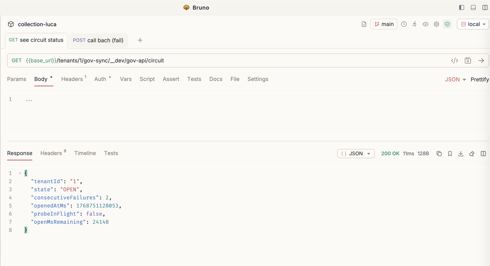
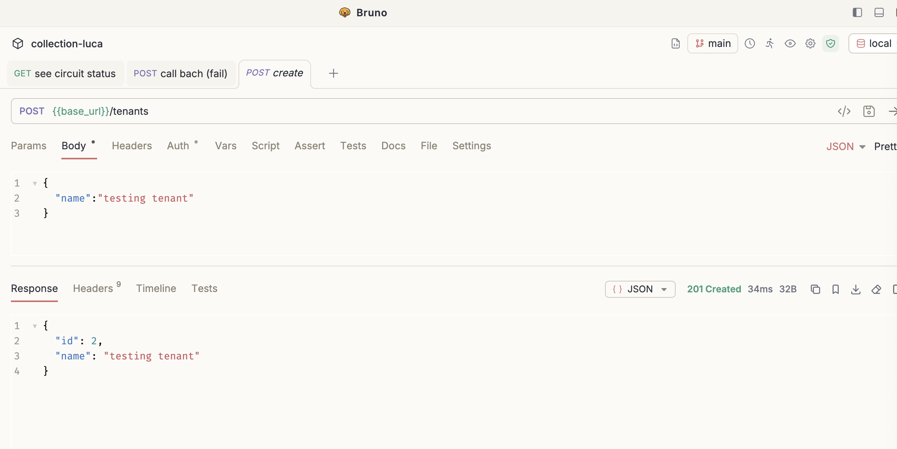
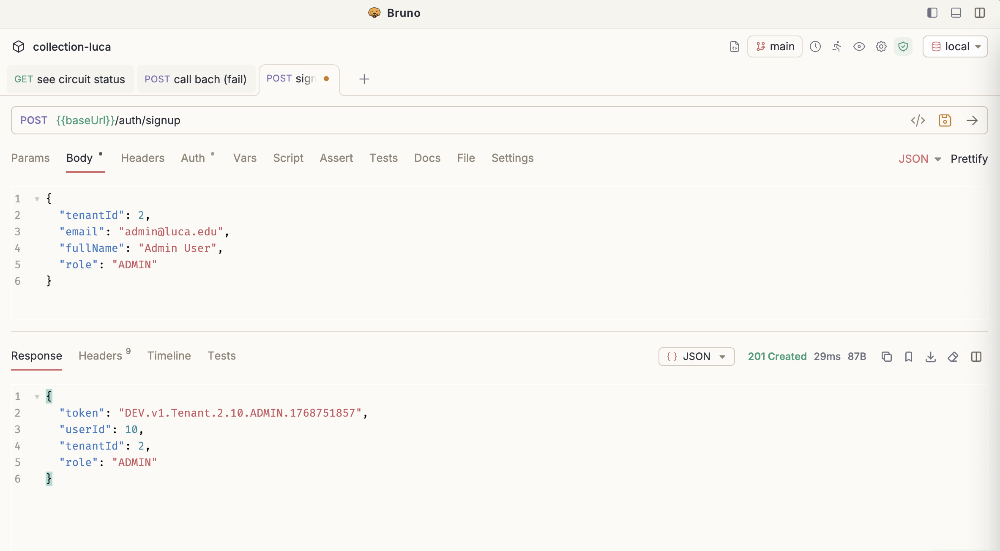
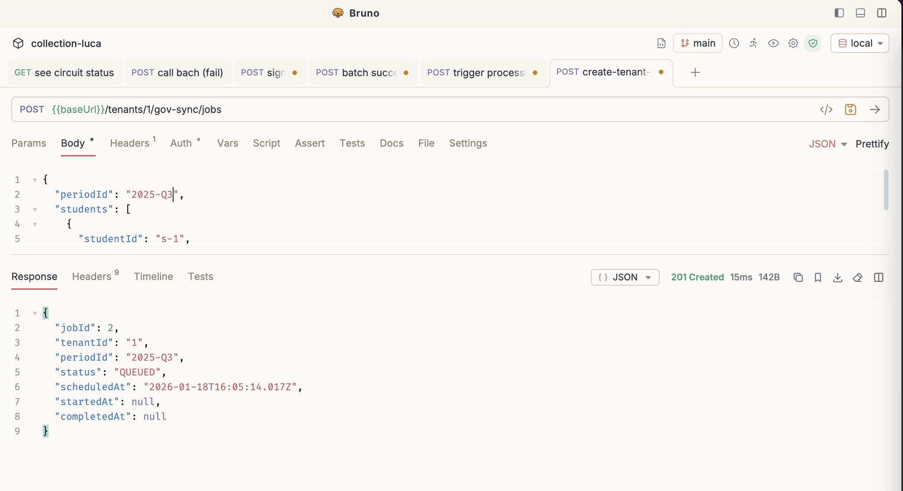
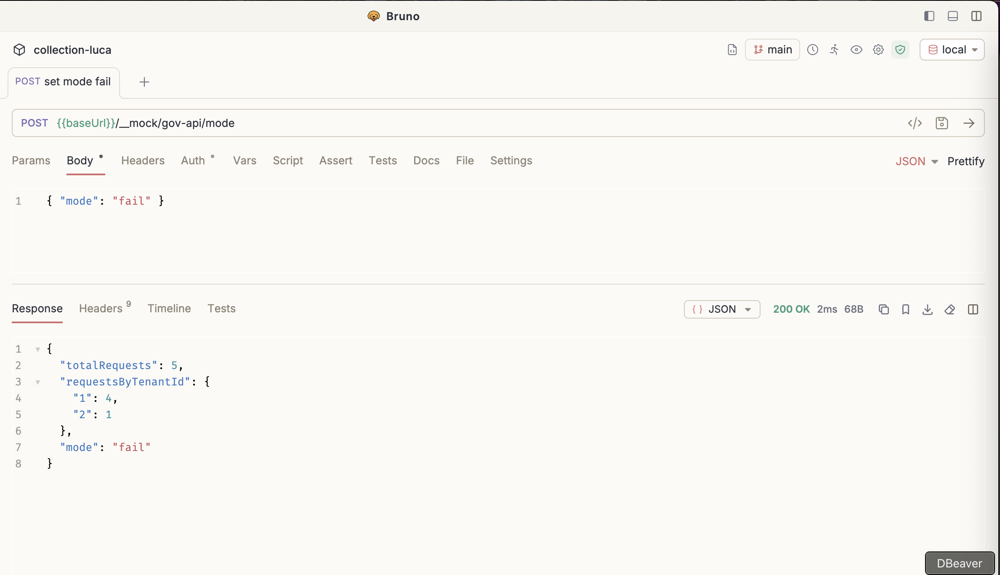
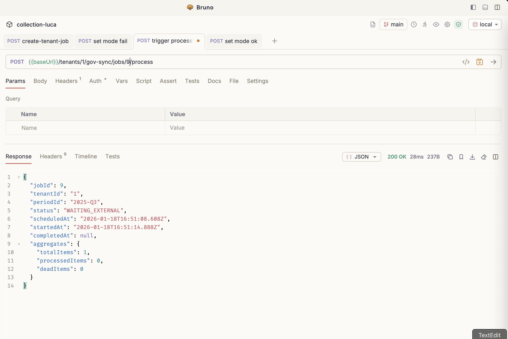
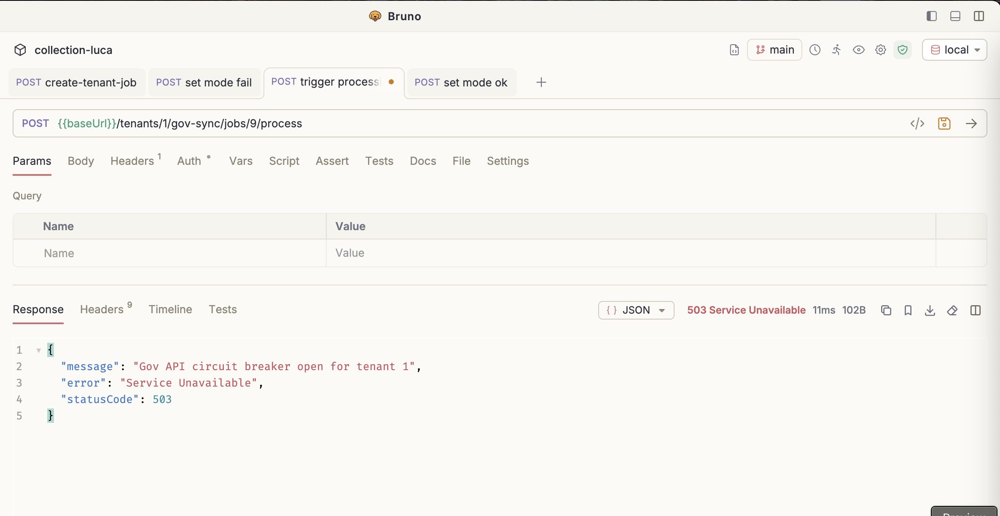
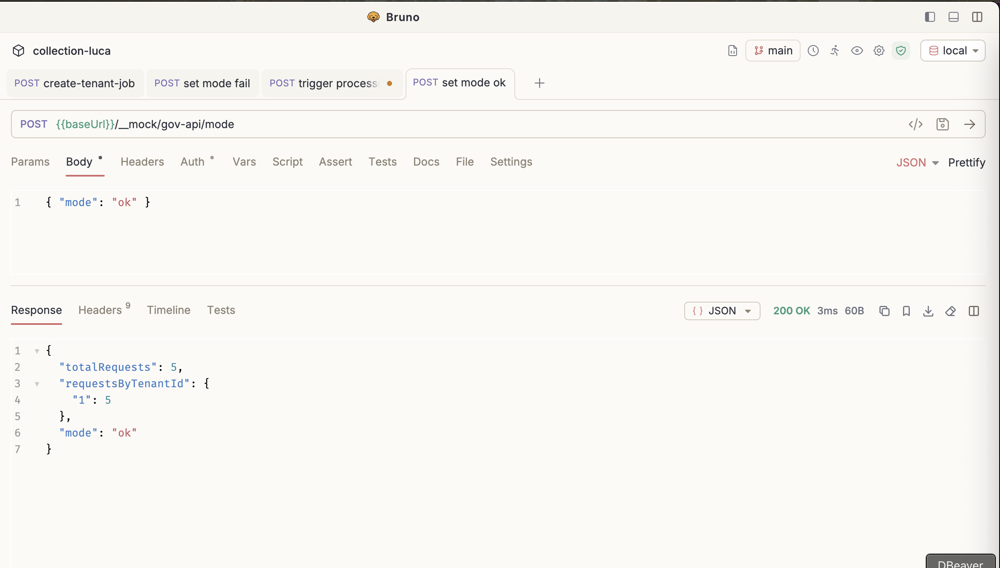

# Luca — Technical Assessment (Diseño + MVP de resiliencia Gov Sync)

Este repositorio es una implementación PoC que acompaña el diseño del sistema pedido en el home assessment y perfil de comportamiento por estudiante, en un contexto multi-tenant con control de acceso y trazabilidad.

El foco del MVP mostrado aquí es la integración resiliente con el "Government API" (mock incluido) y, en particular, el **circuit breaker por tenant** como protección ante fallas/latencias típicas de integraciones gubernamentales.

---

## Documentación (diseño)

- [Diseño del sistema](./docs/SYSTEM_DESIGN.md) — arquitectura, flujos write/read/sync, latencia, operación.
- [Modelo de datos](./docs/DATA_MODEL_DESIGN.md) — tablas, índices, multi-tenant y trazabilidad.
- [API Reference](./API.md) — endpoints.
- [Testing](./TESTING.md) — estrategia de pruebas.

---

## Stack tecnológico

- **Runtime / Framework**: [NestJS](https://nestjs.com/)
- **DB**: PostgreSQL (Docker Compose)
- **ORM**: TypeORM
- **Package manager**: `pnpm`
- **API docs**: Swagger en `/api`
- **Tests**: Jest

---

## Cómo levantar el proyecto (local)

### Prerrequisitos

- Docker y Docker Compose
- Node.js (compatible con NestJS)
- `pnpm` instalado globalmente

### 1) Levantar PostgreSQL

Este repo trae dos bases:
- **dev** en el puerto `57432`
- **test** en el puerto `57433`

```bash
docker compose up -d postgres-dev postgres-test
```

### 2) Instalar dependencias

```bash
pnpm install
```

### 3) Migraciones (dev)

Nota: 
Si no seteas `NODE_ENV`, el sistema asume `local`.
Si no seteas `DB_SCHEMA`, se asume `public`

```bash
export NODE_ENV=local
pnpm run db:run
```

### 4) Configurar env vars mínimas

El cliente de gobierno necesita el dato `GOV_API_BASE_URL`. Para el demo, lo apuntamos al mock dentro de la misma app:

```bash
export GOV_API_BASE_URL="http://localhost:3000/__mock/gov-api"
```

Opcionales (para ver el breaker actuar rápido):
- `GOV_API_TIMEOUT_MS` (default interno razonable)
- `GOV_API_CB_FAILURE_THRESHOLD` (default: `3`)
- `GOV_API_CB_OPEN_MS` (default: `5000`)

Ejemplo:

```bash
export GOV_API_TIMEOUT_MS="75"
export GOV_API_CB_FAILURE_THRESHOLD="2"
export GOV_API_CB_OPEN_MS="150"
```

Estos datos estan mostrados en el .env.example

### 5) Correr la API

```bash
pnpm dev
```

Swagger: `http://localhost:3000/api`


---

## MVP: Gov Sync + Circuit Breaker (por qué existe y cómo probarlo)

### ¿Qué problema se esta resolviendo?

Integraciones con APIs gubernamentales suelen presentar:
- timeouts y latencias impredecibles,
- ventanas de degradación/intermitencia,
- límites estrictos de rate/infra variable,
- necesidad de terminar procesos batch sin "tumbar" el sistema interno.

Por eso este MVP incluye un circuit breaker por tenant en `GovApiClient`:
- **CLOSED**: opera normal.
- **OPEN**: falla rápido y evita golpear la api de gobierno durante una ventana de enfriamiento.
- **HALF_OPEN**: permite un “probe” controlado para decidir si se recuperó.


Esto protege:
- latencia del sistema interno,
- la BD (evita cascadas de retries y saturación),
- y reduce carga hacia el API externo cuando ya está degradado.




---

## Demo rápida (cURL)

### 0) Crear tenant

```bash
TENANT_ID=$(
  curl -s -X POST "http://localhost:3000/tenants" \
    -H "content-type: application/json" \
    -d '{"name":"School Demo"}' \
  | node -pe "JSON.parse(fs.readFileSync(0,'utf8')).id"
)
echo "TENANT_ID=$TENANT_ID"
```



### 1) Dev signup (crea usuario + token DEV)

```bash
TOKEN=$(
  curl -s -X POST "http://localhost:3000/auth/signup" \
    -H "content-type: application/json" \
    -d "{\"tenantId\":$TENANT_ID,\"email\":\"admin@school.edu\",\"fullName\":\"Admin\",\"role\":\"ADMIN\"}" \
  | node -pe "JSON.parse(fs.readFileSync(0,'utf8')).token"
)
echo "TOKEN=$TOKEN"
```


### 2) Crear job de gov-sync

```bash
JOB_ID=$(
  curl -s -X POST "http://localhost:3000/tenants/$TENANT_ID/gov-sync/jobs" \
    -H "authorization: Bearer $TOKEN" \
    -H "content-type: application/json" \
    -d '{"periodId":"2025-Q1"}' \
  | node -pe "JSON.parse(fs.readFileSync(0,'utf8')).jobId"
)
echo "JOB_ID=$JOB_ID"
```




## Simular degradación y ver el circuit breaker

### 1) Poner el mock en modo fail o timeout

```bash
curl -s -X POST "http://localhost:3000/__mock/gov-api/mode" \
  -H "content-type: application/json" \
  -d '{"mode":"fail"}' >/dev/null
```

o:

```bash
curl -s -X POST "http://localhost:3000/__mock/gov-api/mode" \
  -H "content-type: application/json" \
  -d '{"mode":"timeout"}' >/dev/null
```



Aqui simulamos que alguien en la dependencia de gobierno hizo un deploy, se empieza a saturar su sistema o empezo a fallar de repente

### 2) empezamos procesamiento (/process) pero falla

Tip: baja `GOV_API_CB_FAILURE_THRESHOLD` a `2` para que abra rápido.

```bash
curl -s -X POST "http://localhost:3000/tenants/$TENANT_ID/gov-sync/jobs/$JOB_ID/process" \
  -H "authorization: Bearer $TOKEN" >/dev/null
curl -s -X POST "http://localhost:3000/tenants/$TENANT_ID/gov-sync/jobs/$JOB_ID/process" \
  -H "authorization: Bearer $TOKEN" >/dev/null
```



### 3) observar OPEN + fail-fast 



Esto nos permite dejar de hacer invocaciones al servicio caido, permitiendo encolar en una DLQ para consecuente reconciliación

### 4) poner mock en modo ok

Simulamos que el sistema vuelve a funcionar ya sea pr un hotfix o se disponibilizaron recursos haciendo una peticion a: 

```bash
curl -s -X POST "http://localhost:3000/__mock/gov-api/mode" \
  -H "content-type: application/json" \
  -d '{"mode":"ok"}' >/dev/null
```




### 4) re-try y funciona

Se deja enfriar el circuito, por un delay, cuando este esta frio, el sistema circuito se pone en half open, permite hacer n cantidad de llamados, si funcionan el sistema vueve a estar cerrado, si empiezan a fallar se abre de nuevo


---

## RBAC + Aislamiento multi-tenant (MVP)

Este repo es un MVP y NO implementa auth productiva. En su lugar, usa un Dev Token simple (para testing) y guards para demostrar:
- **Autenticación**: token presente, parseable y registrado en store.
- **RBAC**: acciones restringidas por rol.
- **Aislamiento multi-tenant**: un token de un tenant no puede operar sobre otro.

### Dev Token (solo para testing)

El token que entrega `/auth/signup` y `/auth/login` tiene el formato:

`DEV.v1.Tenant.{tenantId}.{userId}.{role}.{timestamp}`

En cada request autenticado:
- `DevTokenGuard` (guard global) valida `Authorization: Bearer <token>`.
- Se parsea el token y se adjunta `authUser` al request con: `tenantId`, `userId`, `role`.
- Además, el token debe existir en la tabla de tokens (se registra en login/signup). Si no existe, se rechaza.

> Nota: esto es deliberadamente simple para la demo; no hay firma, expiración JWT, refresh tokens, etc.

### Roles disponibles

Los roles del MVP son:
- `ADMIN`
- `PRINCIPAL`
- `TEACHER`

### Aislamiento por tenant (TenantParamGuard)

En los endpoints con path `/tenants/:tenantId/...`, el `TenantParamGuard` compara:
- `tenantId` del token (claim)
- vs `tenantId` del path param

Si no coinciden, responde **403** con `Tenant mismatch` (esto es lo que se ve en Bruno cuando intentas llamar un endpoint de tenant con un token de otro tenant).


### Acciones ADMIN-only (AdminRoleGuard)

Algunas operaciones están restringidas a `ADMIN`:
- `POST /tenants/:tenantId/gov-sync/jobs` (crear job)
- `POST /tenants/:tenantId/gov-sync/jobs/:jobId/process` (procesar job)
- Endpoints de desarrollo del cliente gov:
  - `/tenants/:tenantId/gov-sync/__dev/gov-api/*` (send batch, ver circuit, etc.)

Las lecturas “no destructivas” del job (p.ej. `GET /tenants/:tenantId/gov-sync/jobs/:jobId`) solo requieren pertenecer al mismo tenant.


### Ejemplo rápido (reproducir Tenant mismatch)

```bash
# Token emitido para tenantId=2
OTHER_TOKEN="DEV.v1.Tenant.2.9.ADMIN.173...."

# Intento de crear job en tenantId=1 con token de tenantId=2 => 403 Tenant mismatch
curl -i -X POST "http://localhost:3000/tenants/1/gov-sync/jobs" \
  -H "authorization: Bearer $OTHER_TOKEN" \
  -H "content-type: application/json" \
  -d '{"periodId":"2025-Q1"}'
```


## Bruno (colección lista para usar)

Si quieres correr el demo sin copiar/pegar cURLs, usa la colección de Bruno:

- **Colección**: `collection-luca/bruno.json`
- **Environment (local)**: `collection-luca/environments/local.bru`

Requests clave (archivos `.bru`):

- **Auth**
  - `collection-luca/auth/signup.bru`
  - `collection-luca/auth/login.bru`
- **Tenants**
  - `collection-luca/tenant/create.bru`
  - `collection-luca/tenant/get.bru`
- **Gov Sync**
  - `collection-luca/gov-sync/create job.bru`
  - `collection-luca/gov-sync/trigger processing.bru`
  - `collection-luca/gov-sync/get job.bru`
  - `collection-luca/gov-sync/gov-api-client-dev/circuit status.bru`
- **Mock Gov API**
  - `collection-luca/gov-sync/mock-gov-api/set mode ok.bru`
  - `collection-luca/gov-sync/mock-gov-api/set mode fail.bru`
  - `collection-luca/gov-sync/mock-gov-api/set mode timeout.bru`

---

## CI/CD y Deploy

- **CI/CD**: el proyecto cuenta con un pipeline funcional en GitHub Actions: `https://github.com/hitzu/luca-home-assessment/actions`
- **Deploy (prod)**: está deployado en Render (plan gratuito), por lo que puede haber límites/cold-starts y mayor tiempo de respuesta; aun así es **100% testeable en producción**.

El base url es: https://luca-home-assessment.onrender.com

## Tests

```bash
pnpm test
pnpm test:gov-sync
pnpm test:e2e
```

Notas:
- En tests se usa `NODE_ENV=test` automáticamente (scripts), con DB `luca_test` (puerto `57433`) y `dropSchema` habilitado buscando test isolation.

