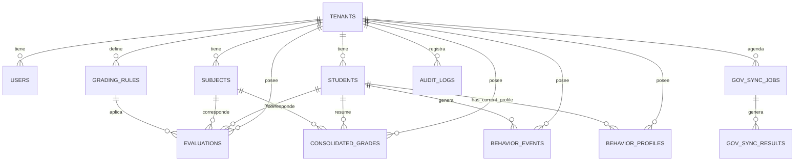
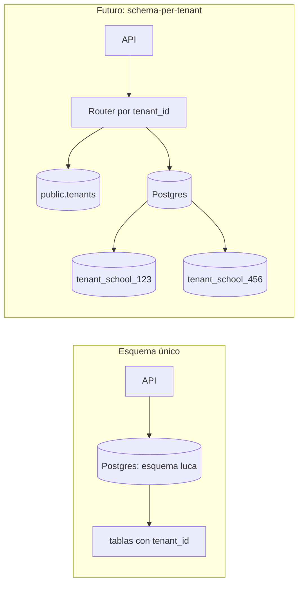

# Estructura del modelo de datos

Este documento describe el modelo de datos lógico. Usamos un único esquema de Postgres y aislamos tenants mediante un `tenant_id` obligatorio en todas las tablas de negocio. El modelo está optimizado para calificaciones centralizadas por periodo, sincronizaciones trimestrales con el gobierno, eventos/perfiles de comportamiento y auditabilidad (RBAC + logs).

Nota multi-tenant: todas las tablas de negocio están siempre scopeadas por `tenant_id`. En una evolución futura se puede incorporar RLS o aislamiento por esquema, pero está fuera de alcance de esta versión.

Nota: el modelo es casi físico, pero no enumera todos los campos. Solo se incluyen los atributos más relevantes para ilustrar llaves, relaciones y decisiones de diseño; la implementación real añadiría más columnas según necesidad.

## Diagrama Entidad-Relación

## Definición de tablas

**Nota: Convención de columnas comunes:**  
Todas las tablas de negocio incluyen, por defecto, las siguientes columnas estandarizadas para mantener consistencia, trazabilidad y facilitar borrado lógico:

- `id` (`integer`, primary key): Identificador único de la fila.
- `created_at` (`timestamptz`, not null, default now()): Fecha y hora de creación del registro.
- `updated_at` (`timestamptz`, not null, default now()): Fecha y hora de última actualización.
- `deleted_at` (`timestamptz`, nullable): Marca lógica de borrado (si es distinto de `null`, el registro se considera eliminado para consultas normales; excelente para auditorías internas y externas).

### Constantes (resumen)
- `consolidated_grades`: UNIQUE (`tenant_id`, `student_id`, `subject_id`, `period_id`).
- `evaluations`: UNIQUE (`tenant_id`, `student_id`, `subject_id`, `period_id`, `evaluation_type`).
- `behavior_events`: UNIQUE (`tenant_id`, `event_id`) para idempotencia.
- `gov_sync_results`: UNIQUE (`tenant_id`, `idempotency_key`) para reintentos seguros.

### tenants

**Columnas**
- `id` (integer, PK) – identificador del tenant.
- `name` (varchar(255), not null) – nombre de la escuela u organizacion.
- `status` (enum: ACTIVE, INACTIVE) – estado del tenant.

### users

**Columnas**
- `id` (integer, PK) – identificador de usuario.
- `tenant_id` (integer, FK -> tenants.id, not null) – pertenencia al tenant.
- `email` (varchar(320), not null) – identificador de login, único por tenant.
- `full_name` (varchar(255), not null).
- `role` (enum: ADMIN, TEACHER, COUNSELOR, VIEWER, not null).
- `scopes` (jsonb, null) – permisos finos por usuario.
- `status` (enum: ACTIVE, SUSPENDED, not null).
- `last_login_at` (timestamptz, null).

**Índices**
- `ux_users_tenant_email` on (`tenant_id`, `email`) – login único por tenant.
- `ix_users_tenant_role` on (`tenant_id`, `role`) – listados RBAC.

### students

**Columnas**
- `id` (integer, PK) – identificador de estudiante.
- `tenant_id` (integer, FK -> tenants.id, not null).
- `external_id` (varchar(64), not null) – identificador SEP o número de matrícula de su escuela.
- `full_name` (varchar(255), not null).
- `grade_level` (varchar(32), not null).
- `status` (enum: ACTIVE, INACTIVE, not null).
- `nickname` (varchar(255), null).

**Índices**
- `ux_students_tenant_external_id` on (`tenant_id`, `external_id`) – importación y sync.
- `ix_students_tenant_grade_level` on (`tenant_id`, `grade_level`) – cohortes.

**Notas**
- PII mínima; evitar campos sensibles en esta tabla.

### subjects

**Columnas**
- `id` (integer, PK) – identificador de asignatura.
- `tenant_id` (integer, FK -> tenants.id, not null).
- `code` (varchar(32), not null) – código de asignatura.
- `name` (varchar(255), not null).

**Índices**
- `ux_subjects_tenant_code` on (`tenant_id`, `code`) – código único por tenant.

**Notas**
- El código se usa en importaciones y reportes.

### grading_rules

**Columnas**
- `id` (integer, PK) – identificador de regla.
- `tenant_id` (integer, FK -> tenants.id, not null).
- `period_id` (varchar(32), not null) – identificador de periodo o término.
- `rules` (jsonb, not null) – reglas y ponderaciones.
- `version` (int, not null, default 1).

**Índices**
- `ix_grading_rules_tenant_period` on (`tenant_id`, `period_id`) – consulta por periodo.

**Notas**
- `rules` de tipo jsonb permite esquemas flexibles por tenant.

### evaluations

**Columnas**
- `id` (integer, PK) – identificador de evaluación.
- `tenant_id` (integer, FK -> tenants.id, not null).
- `student_id` (integer, FK -> students.id, not null).
- `subject_id` (integer, FK -> subjects.id, not null).
- `grading_rule_id` (integer, FK -> grading_rules.id, null).
- `period_id` (varchar(32), not null).
- `evaluation_type` (varchar(64), not null) – quiz, examen, tarea, etc.
- `score` (numeric(6,2), not null).
- `max_score` (numeric(6,2), not null).
- `evaluated_at` (timestamptz, not null).

**Índices**
- `ix_evaluations_tenant_student_period_subject` on (`tenant_id`, `student_id`, `period_id`, `subject_id`) – lectura para calificaciones.
- `ix_evaluations_tenant_subject_period` on (`tenant_id`, `subject_id`, `period_id`) – analítica por asignatura.

**Restricciones**
- `ux_evaluations_tenant_student_subject_period_type` UNIQUE (`tenant_id`, `student_id`, `subject_id`, `period_id`, `evaluation_type`) – evita duplicados por reprocesamiento.

### consolidated_grades

**Columnas**
- `id` (integer, PK) – identificador de nota consolidada.
- `tenant_id` (integer, FK -> tenants.id, not null).
- `student_id` (integer, FK -> students.id, not null).
- `subject_id` (integer, FK -> subjects.id, not null).
- `period_id` (varchar(32), not null).
- `grading_rule_id` (integer, FK -> grading_rules.id, null).
- `final_score` (numeric(6,2), not null).
- `calculated_at` (timestamptz, not null).

**Índices**
- `ix_consolidated_grades_tenant_student_period` on (`tenant_id`, `student_id`, `period_id`) – precálculos para lecturas rápidas y snapshots.

**Constantes**
UNIQUE(tenant_id, student_id, subject_id, period_id) para evitar duplicados.

**Restricciones**
- `ux_consolidated_grades_tenant_student_subject_period` UNIQUE (`tenant_id`, `student_id`, `subject_id`, `period_id`) – evita filas duplicadas de consolidación en reprocesos.

### behavior_events

**Columnas**
- `id` (integer, PK) – identificador de evento.
- `tenant_id` (integer, FK -> tenants.id, not null).
- `student_id` (integer, FK -> students.id, not null).
- `event_id` (varchar(128), not null) – idempotency key del evento canónico.
- `event_type` (varchar(64), not null) – asistencia, participación, etc.
- `occurred_at` (timestamptz, not null).
- `metadata` (jsonb, null) – payload del evento.
- `source` (varchar(64), null) –

**Índices**
- `ux_behavior_events_tenant_event_id` on (`tenant_id`, `event_id`) UNIQUE – dedupe de eventos reintentados.
- `ix_behavior_events_tenant_student_occurred` on (`tenant_id`, `student_id`, `occurred_at`) – timeline por estudiante.
- `ix_behavior_events_tenant_occurred` on (`tenant_id`, `occurred_at`) – exploración temporal por tenant.

Esto evita duplicados cuando adapters o workers reintentan la publicación del mismo evento.

**Particionamiento sugerido**
- Particionar por tiempo (mensual) usando `occurred_at`. Si el volumen lo exige, sub‑particionar por `tenant_id`.

### behavior_profiles

**Columnas**
- `id` (integer, PK).
- `tenant_id` (integer, FK -> tenants.id, not null).
- `student_id` (integer, FK -> students.id, not null).
- `last_period_id` (string o integer) – último periodo consolidado para el snapshot online.
- `last_event_at` (timestamptz) – último evento considerado en el perfil.
- `engagement_score` (numeric, ej. 0–100).
- `attendance_score` (numeric).
- `risk_level` (enum: LOW, MEDIUM, HIGH).
- `flags` (jsonb, ej. ["AT_RISK", "HIGH_POTENTIAL"]).
- `last_activity_at` (timestamptz).
- `features_snapshot` (jsonb, opcional, subconjunto de features usados para el cálculo).
- `explanation` (jsonb, opcional, mínimas razones/importancia para el perfil actual).

**Índices**
- `ux_behavior_profiles_tenant_student` (`tenant_id`, `student_id`) UNIQUE – 1 snapshot online por estudiante.
- `idx_behavior_profiles_tenant_risk_level` (`tenant_id`, `risk_level`) – dashboards y alertas.

Esta tabla es la fuente de verdad del comportamiento online: 1 fila por (`tenant_id`, `student_id`) para servir lecturas rápidas. Para análisis histórico por periodo se usa una tabla `behavior_profiles_history` (o analítica offline sobre `behavior_events`), con índice (`tenant_id`, `student_id`, `period_id`) y particionado por `period_id` o año. Esto evita escanear millones de `behavior_events` en el read path y permite cumplir el SLA de latencia para “perfil + nota consolidada”. Es el punto natural para scoring basado en reglas via `explanation` y `features_snapshot`.

### Particionamiento y retención

- Tablas de alto volumen: `behavior_events`, `behavior_profiles_history`, `audit_logs`.
- Particionado principal por tiempo o periodo (`occurred_at` / `period_id`); en escenarios extremos, sub‑particionar por `tenant_id`.
- Retención: mantener N años activos y archivar o dropear particiones antiguas según políticas del cliente.

### gov_sync_jobs

**Columnas**
- `id` (integer, PK) – identificador de job.
- `tenant_id` (integer, FK -> tenants.id, not null).
- `period_id` (varchar(32), not null).
- `window_start` (date, not null).
- `window_end` (date, not null).
- `status` (enum: QUEUED, RUNNING, WAITING_EXTERNAL, PARTIALLY_COMPLETED, COMPLETED, FAILED, not null).
- `scheduled_at` (timestamptz, not null).
- `started_at` (timestamptz, null).
- `completed_at` (timestamptz, null).

**Índices**
- `ix_gov_sync_jobs_tenant_status_scheduled` on (`tenant_id`, `status`, `scheduled_at`) – scheduler y monitoreo.

### gov_sync_results

**Columnas**
- `id` (integer, PK) – identificador de resultado.
- `job_id` (integer, FK -> gov_sync_jobs.id, not null).
- `tenant_id` (integer, FK -> tenants.id, not null).
- `student_id` (integer, FK -> students.id, not null).
- `period_id` (varchar(32), not null).
- `status` (enum: ACCEPTED, REJECTED, CORRECTED, ERROR, DEAD, WAITING_EXTERNAL, not null).
- `attempt_number` (int, not null, default 1) – intento actual para este student/period.
- `external_record_id` (varchar(128), null).
- `idempotency_key` (varchar(128), not null).
- `error_code` (varchar(64), null).
- `error_message` (text, null).
- `raw_request` (jsonb, null; auditoría o SLA).
- `raw_response` (jsonb, null; auditoría o SLA).
- `synced_at` (timestamptz, null).
- `next_retry_at` (timestamptz, null) – cuándo este registro es elegible para reintento (backoff).

**Índices**
- `ux_gov_sync_results_tenant_idempotency` (`tenant_id`, `idempotency_key`) UNIQUE – reintentos seguros sin duplicar envíos.
- `ix_gov_sync_results_job_status` on (`job_id`, `status`) – avance del job.

Reintentos no duplican registros: si existe una fila con el mismo (`tenant_id`, `idempotency_key`), se reutiliza y se actualiza `attempt_number`, `status` y timestamps; no se inserta una nueva fila.
Los estados se alinean con el flujo de sincronización del sistema (incluye fallas definitivas y esperas externas).

### audit_logs

**Columnas**
- `id` (integer, PK) – identificador de auditoría.
- `tenant_id` (integer, FK -> tenants.id, not null).
- `actor_id` (integer, FK -> users.id, not null).
- `action` (varchar(128), not null).
- `resource_type` (varchar(128), not null).
- `resource_id` (integer, null).
- `metadata` (jsonb, null).
- `ip_address` (inet, null).

**Índices**
- `ix_audit_logs_tenant_actor` on (`tenant_id`, `actor_id`, `created_at`) – investigaciones y línea de tiempo.
- `ix_audit_logs_tenant_resource` on (`tenant_id`, `resource_type`, `resource_id`) – trazabilidad por entidad.
- `ix_audit_logs_tenant_action_time` on (`tenant_id`, `action`, `occurred_at`) – monitoreo de acciones.

Evitar PII cruda en `audit_logs`: minimizar payload y, cuando aplique, hashear identificadores sensibles. `tenant_id` siempre se registra para scope multi‑tenant.

## Consideraciones Multi-tenant

- Todas las tablas de negocio incluyen `tenant_id` con FK a `tenants.id`.
- Toda consulta crítica debe filtrar por `tenant_id` para evitar fugas de datos.
- Evolución futura: esquema por tenant o RLS en Postgres.
- Este modelo lógico es compatible con ambas estrategias.

### Multi-tenancy y aislamiento de datos

Para la implementación propuesta uso un único esquema lógico con columna `tenant_id` en todas las tablas de negocio (students, grades, events, etc.), además de:

- Filtros por `tenant_id` en todas las consultas provenientes de contextos autenticados.
- Índices que incluyen `tenant_id` para mantener consultas rápidas (ej. `idx_students_tenant_id_student_id`).
- Auditoría que siempre registra `tenant_id` para investigación y reporting.

Este diseño es simple de operar (un pipeline de migraciones, un solo esquema lógico) y es suficiente para la escala asumida en este ejercicio.

Como **evolución futura**, podríamos pasar a un modelo **schema-per-tenant**:

- Cada escuela con su propio esquema (`tenant_school_123`), mientras `public.tenants` mantiene la información de ruteo.
- Mayor aislamiento de datos (mejor blast radius y límites de auditoría más claros).
- Unidad natural para mover tenants grandes a instancias o clusters dedicados de Postgres.

Dadas las restricciones de tiempo y el enfoque del challenge (latencia, procesamiento de eventos, sincronización gubernamental y observabilidad), propongo empezar con un solo esquema y dejo schema-per-tenant como un camino de evolución claro.

