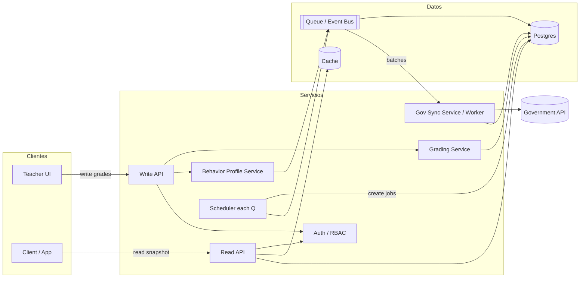
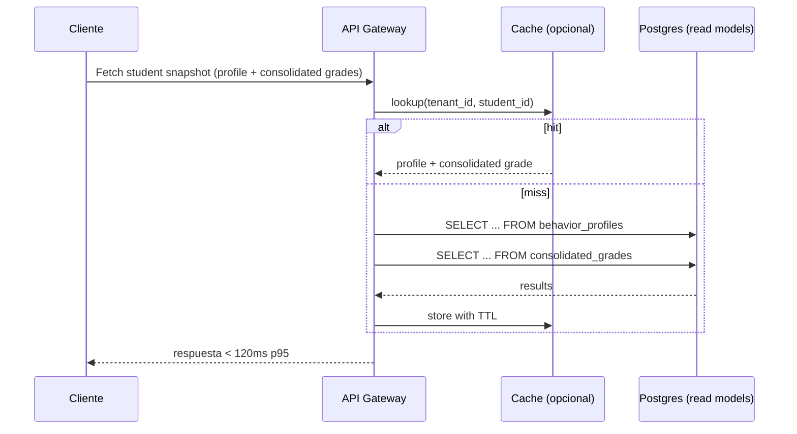
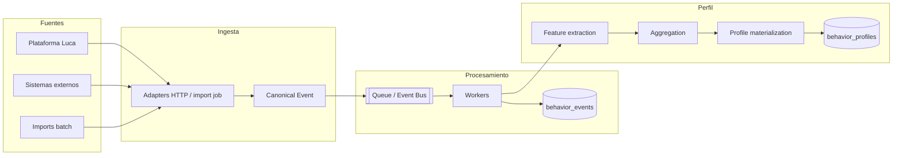
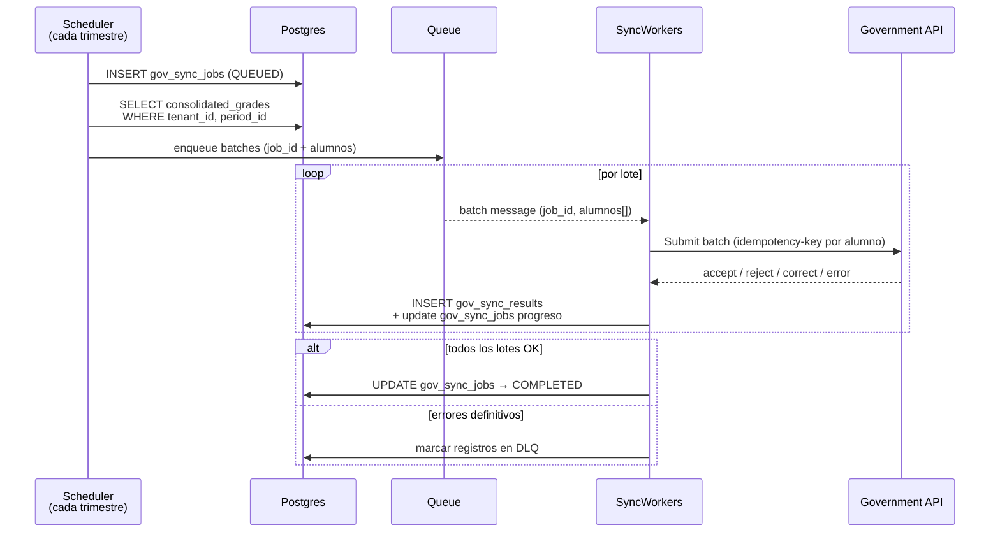
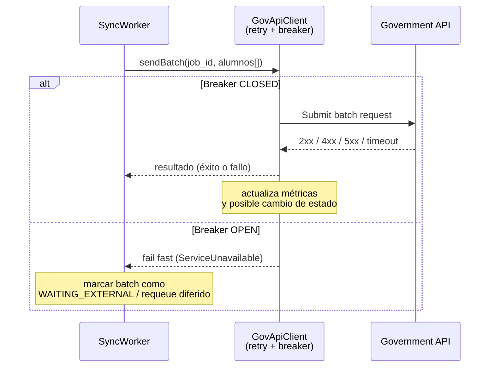
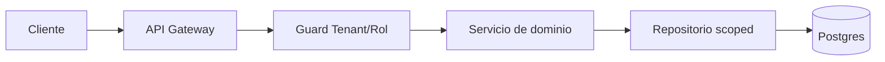

# Diseño del Sistema para Luca

## 1) Visión general (Overview)

Sistema distribuido multi-tenant para gestionar evaluaciones académicas, sincronización trimestral con una API gubernamental y perfiles de comportamiento estudiantil. 

### 1.1) Requisitos clave
- Lectura 1:1 con p95 < 120ms y p99 < 250ms
- Aislamiento multi-tenant sin fugas de datos + auditoría completa
- Sincronización gubernamental en < 48h para todos los tenants

## 2) Arquitectura de alto nivel

Componentes principales:
- API y servicios de dominio (calificaciones, perfil de comportamiento).
- Workers y scheduler para sincronización gubernamental y jobs batch.
- Postgres como fuente de verdad para el core y los modelos de lectura.
- Capa de eventos/colas para ingesta y procesamientos asíncronos.
- Servicio de autenticación/RBAC.



Resumen (at a glance):
- **Write path**: docentes envían evaluaciones/actividades → write API → event bus / DB → cómputo asíncrono de `consolidated_grades` y `behavior_profiles`.
- **Read path**: clientes piden el snapshot de un estudiante → read API → `behavior_profiles` + `consolidated_grades` (con cache) para cumplir p95/p99.
- **Sync path**: un scheduler crea `gov_sync_jobs` por tenant+periodo → workers llaman al API gubernamental con requests idempotentes y registran resultados en `gov_sync_results`.

## 3) Modelo de datos y multi-tenant

El detalle del modelo lógico, relaciones clave y estrategia multi-tenant vive en [DATA_MODEL_DESIGN.md](./DATA_MODEL_DESIGN.md).

## 4) Lectura de perfil + nota consolidada (enfoque en latencia)

Modelo de lectura:
- `consolidated_grades` precomputado por `(tenant_id, student_id, period)`.
- `behavior_profiles` precomputado por `(tenant_id, student_id)`.
Nota: ver [`DATA_MODEL_DESIGN.md#behavior_profiles`](./DATA_MODEL_DESIGN.md#behavior_profiles) para el detalle del modelo de lectura de comportamiento.



Estrategia de latencia: tabla precomputada, índices compuestos `(tenant_id, student_id)` y protección con cache con TTL (in-memory hoy, intercambiable por Redis).

#### 4.1) Anti-stampede (single-flight por alumno/periodo)
- Cache key: `(tenant_id, student_id, period_id)`.
- Si múltiples requests llegan a la vez y el cache está vacío, **solo una request** ejecuta los queries; las demás esperan el mismo resultado.
- Esto evita el thundering herd sobre Postgres y mantiene p95/p99 estables en bursts de lectura.

Nota: el read path solo sirve desde `behavior_profiles` (snapshot online) + `consolidated_grades`. No se consulta `behavior_events` en línea para no degradar la latencia.

## 5) Perfil de comportamiento por estudiante

#### Objetivo del pipeline

Buscamos absorber eventos de múltiples orígenes (LMS interno, disciplina escolar, imports históricos) sin impactar la latencia de lectura. El objetivo es unificar todo en un **evento canónico** consistente y persistir el histórico completo para auditoría y reprocesamiento.

#### Fuentes de datos y “adapters” de entrada

Fuentes típicas:
- Plataforma Luca (login, quiz completado, entrega tarde, sesión iniciada).
- Sistemas externos de la escuela (ausencias, reportes disciplinarios, reconocimientos).
- Imports batch históricos (CSV/JSON).

Cada fuente entra por un adapter dedicado (endpoint HTTP o job de import) para aislar formatos y ritmos.

En estos adapters:
- Se resuelve `tenant_id` (API key, dominio o token JWT).
- Se mapea `student_id` interno desde el identificador externo.
- Se valida lo mínimo: esquema, timestamps y tipo de evento.
- No hay lógica pesada: solo “recibir y validar lo básico”.

#### Normalización a un evento canónico (ETL ligera)

Todos los eventos se convierten a un evento canónico con un esquema estable, para facilitar el procesamiento downstream y mantener consistencia cross-tenant:

```json
{
  "tenantId": "integer",
  "studentId": "integer",
  "source": "enum",
  "eventType": "enum",
  "occurredAt": "2024-02-15T10:23:00Z",
  "payload": { "...": "..." },
  "idempotencyKey": "string"
}
```

Un proceso ETL realiza las siguientes acciones:
- Normalización de campos (fechas, códigos, enums).
- Dedupe básico por `idempotencyKey`.

#### Ingesta, cola y persistencia del histórico

Luego de normalizar:
- El adapter publica el evento en `Q` (cola/event bus) y responde rápido (`202 Accepted`).
- Workers desacoplados consumen en lotes con back-pressure.
- Se persiste en `behavior_events` como fuente de verdad del histórico.

Esto permite absorber picos, re-procesar por cambios de reglas y mantener auditoría completa.

#### Construcción del behavior profile

El cálculo del perfil se orquesta como un pipeline tipo Step Function o equivalente con etapas claras y reintentos:
- **Feature extraction**: métricas base (asistencias, puntualidad, engagement).
- **Aggregation**: ventanas móviles (7/30/90 días) y scores.
- **Profile materialization**: actualización incremental en `behavior_profiles`.

El resultado es un modelo de lectura optimizado por `(tenant_id, student_id)` que sirve respuestas de baja latencia.



### 5.1) Picos altos de eventos (absorción sin caída)

**Objetivo**: soportar picos de ingesta de eventos del pipeline de comportamiento sin degradar la lectura de perfiles ni la operación core.

Estrategia:
- **Buffer asíncrono (cola/event bus)**
  - Endpoint de ingesta ejemplo POST /events:
    - valida lo mínimo (tenant, student, tipo de evento).
    - **POST /events escribe en la cola `Q`** (cola/event bus) y responde rápido (`202 Accepted`).
    - La persistencia y el cálculo de agregados se mueven a un worker desacoplado.
- **Workers y back-pressure controlado**
  - Workers consumen de `Q` y **aplican back-pressure** (rate limit por tenant + requeue/delay cuando se alcanza el límite), procesando en lotes (batch size configurable)
    - Escriben en `behavior_events` y actualizan `behavior_profiles` de forma incremental.
    - Se puede escalar horizontalmente el número de workers desde alguna variable de entorno según:
      - profundidad de la cola,
      - lag de procesamiento,
      - ventanas de horario escolar.
- **Degradación funcional controlada**
  - Durante picos muy altos:
    - Solo se actualizan señales rápidas.
    - Features pesadas (modelos ML, agregados complejos) se mandan a un batch nocturno.

## 6) Sincronización trimestral con el API del gobierno

Objetivo: enviar, cada trimestre y por tenant, un snapshot de notas consolidadas al API gubernamental garantizando:

- Idempotencia por alumno/periodo.
- Trazabilidad completa (qué se envió, qué respondió el gobierno, cuándo).
- SLA de finalización < 48h sin tumbar el sistema interno.
- Protección frente a APIs externas degradadas (rate limiting, retries y circuit breaker).

### 6.1 Modelo de jobs y batches

Usamos dos tablas principales (ver [`DATA_MODEL_DESIGN.md`](./DATA_MODEL_DESIGN.md)):

- `gov_sync_jobs`: describe un job trimestral por `tenant_id + period`.
- `gov_sync_results`: un registro por alumno enviado en ese job (incluye idempotency key y raw request/response).

Flujo alto nivel:




**Batching**: cada mensaje de cola contiene un conjunto de alumnos (ej. 100) para minimizar overhead pero mantener granularidad.

**Trazabilidad**: cada intento queda en gov_sync_results con raw_request, raw_response, timestamps y razón de error si aplica.

### 6.2 Idempotencia

Definimos una clave idempotente por envío:

`idempotency_key = hash(tenant_id, period_id, student_id, payload_signature)`


Se persiste en gov_sync_results.idempotency_key.

Ante reintentos, el worker:

- Busca si existe un resultado previo con esa idempotency_key.
- Si lo hay, no vuelve a aplicar efectos, solo reutiliza el resultado.

Esto permite:

- Reintentos seguros ante timeouts/errores 5xx.
- Reproceso parcial sin duplicar registros en el API del gobierno (asumiendo que el gobierno también respeta idempotencia, o al menos no se rompe ante reenvíos).

### 6.3 Rate limiting y concurrencia

Queremos terminar < 48h sin reventar ni nuestro sistema ni el del gobierno.

Decisiones:

- **Concurrencia controlada en workers**:
  - Máximo N requests en vuelo por proceso (configurable).
  - Batch size configurable (ej. 50–200 alumnos por llamada).
- **Rate limit multi-tenant**:
  - Límites globales (ej. 100 req/s totales) y por tenant (ej. 10 req/s).
  - Implementable con token bucket en memoria y movible luego a Redis.
- **Back-pressure**:
  - Si el rate limit se alcanza, el worker reprograma el batch (requeue con delay) en lugar de hacer busy loop.
  - Marca el job como RUNNING pero con progreso parcial para operar sobre él desde monitoreo.

### 6.4 Retries, DLQ y reconciliación

**Retries**:

- Retries con backoff exponencial + jitter para errores transitorios: timeouts, 5xx, errores de red.
- Límite de reintentos por alumno (ej. 5 intentos).
- Se registra retry_count y último error en gov_sync_results.

**DLQ (Dead Letter Queue lógica)**:

- Cuando un envío supera el máximo de reintentos o devuelve un error no recuperable (ej. datos inválidos), se marca como: `status = DEAD` en gov_sync_results.
- dlq_reason, error_code, error_message poblados.
- gov_sync_jobs expone agregados: Nº de registros OK, con error recuperable, en DLQ, etc.

**Reconciliación**:

- Proceso batch (o endpoint interno) que recorre registros DEAD o ERROR.
- Permite reintentos manuales (ej. tras corrección de datos).
- Exporta CSV/JSON de discrepancias para equipos de soporte.

### 6.5 Client al gobierno con Circuit Breaker

Todas las llamadas al API gubernamental pasan por GovApiClient, que encapsula:

Retries con backoff.

Circuit breaker con estados CLOSED, OPEN, HALF_OPEN.




Política del breaker (ejemplo):

- **CLOSED → OPEN** si:
  - 50% errores en la última ventana de 1–2 minutos o
  - p95 de latencia > umbral (ej. 2–3s).
- **OPEN → HALF_OPEN** tras período de enfriamiento (ej. 60–120s).
- **HALF_OPEN → CLOSED** si las llamadas de prueba son exitosas; de lo contrario, vuelve a OPEN.

Cuando el breaker está OPEN:

- Los workers no golpean al gobierno (fail fast).
- Los jobs quedan en estado WAITING_EXTERNAL o similar, pero dentro del SLA de 48h.
- Se generan logs estructurados con el cambio de estado.
- Métricas y alertas (ej. “Government API degraded”).

Entonces:

- Si el gobierno está caído/lento, el breaker se abre y el sistema interno sigue sano.
- Dashboard muestra cuántos jobs están bloqueados por dependencia externa.
- Podemos comunicar a los tenants el impacto y la ventana esperada de reintento sin perder trazabilidad ni SLA interno.

### 6.6 Capacity & 48h SLA plan
Supuestos de orden de magnitud:
- 200 tenants activos.
- 2,000 estudiantes por tenant (p95), ~400k estudiantes totales.
- 1 payload por estudiante/periodo → 400k registros por sync trimestral.

Si cada request envía batch de 100 alumnos:
- 400k / 100 = 4,000 llamadas HTTP por sync total.
- En 48h (172,800s), se requiere **~0.03 req/s** promedio.
- Con 5 workers y concurrencia 2 cada uno → 10 req/s sostenidos, el sync termina en minutos/horas, no días.

Esto deja amplio margen para **retries, backoff, rate limiting** y ventanas degradadas del API externo sin romper el SLA de 48h.


## 7) Seguridad multi-tenant, RBAC, PII y auditoría

### 7.1 Modelo multi-tenant y roles

Modelo base:

- `tenants` – escuelas/colegios.
- `users` – asociados a un `tenant_id` (FK → tenants.id) con un `role` (ej: `ADMIN`, `TEACHER`, `VIEWER`).
- Todo request autenticado tiene un **tenant implícito**: no confiamos en `tenant_id` que venga en el body o query, solo en el contexto de autenticación (JWT/session).

Ejemplo conceptual de claims JWT:

```json
{
  "sub": "user-123",
  "tenant_id": "tenant-abc",
  "role": "TEACHER",
  "exp": 1735689600
}
```
Objetivo: ningún query se ejecuta sin filtrar por tenant_id, y ningún usuario puede ver datos de otro tenant.

> **Principio clave**: el tenant es parte del contexto de seguridad, no un parámetro de negocio.

Capas de aislamiento:

- **Auth context**: el tenant vive en `req.user` (JWT/session), no en input del cliente.
- **Aplicación**: servicios/queries siempre reciben `tenantId` explícito y lo propagan.
- **Datos**: índices compuestos `(tenant_id, ...)` y, cuando aplica, RLS o filtros obligatorios en repositorios.
- **Cache / read models**: claves incluyen `tenant_id` para evitar contaminación cross-tenant.

Puntos de control típicos:

- Guards en el borde (API).
- Repositorios con “scope” por tenant como regla de diseño.
- Jobs/Workers con payloads que incluyen `tenant_id`.
- Observabilidad con `tenant_id` en logs y trazas (sin PII).

### 7.2 Guard NestJS (tenant + rol) – ejemplo mínimo

La idea es usar un guard que:

- Lea `tenantId` y `role` desde `request.user` (inyectado por la capa de auth).
- Verifique que estén presentes.
- Opcionalmente, valide que cualquier `tenantId` en la URL coincida con el del token.
- Aplique una verificación básica de rol.

```
import {
  CanActivate,
  ExecutionContext,
  ForbiddenException,
  Injectable,
} from '@nestjs/common';

@Injectable()
export class TenantRoleGuard implements CanActivate {
  constructor(private readonly allowedRoles: string[] = []) {}

  canActivate(context: ExecutionContext): boolean {
    const req = context.switchToHttp().getRequest();
    const user = req.user;

    if (!user?.tenantId) {
      throw new ForbiddenException('Missing tenant context');
    }

    if (this.allowedRoles.length > 0 && !this.allowedRoles.includes(user.role)) {
      throw new ForbiddenException('Insufficient role');
    }

    // A partir de aquí, toda la capa de aplicación usa req.user.tenantId
    return true;
  }
}
```

### Matriz ejemplo RBAC (roles → acciones permitidas)

| Rol        | Puede configurar reglas de calificación | Puede editar evaluaciones | Puede ver perfiles de comportamiento | Puede disparar la sincronización con gobierno | Puede ver resultados de la sincronización | Operaciones de administrador del tenant |
|------------|-----------------------------------------|----------------------------|--------------------------------------|----------------------------------------------|------------------------------------------|------------------------------------------|
| ADMIN      | Sí                                      | Sí                         | Sí                                   | Sí                                           | Sí                                       | Sí                                       |
| TEACHER    | No (o limitado por clase)               | Sí (sus estudiantes)       | Sí (sus estudiantes)                 | No                                           | Limitado (sus estudiantes)               | No                                       |
| COUNSELOR  | No                                      | No                         | Sí (estudiantes asignados)           | No                                           | Limitado (estudiantes asignados)         | No                                       |
| VIEWER     | No                                      | No                         | Solo lectura                         | No                                           | Solo lectura                             | No                                       |


- La aplicación se encarga de aplicar estas reglas en los *guards* (claims del JWT: tenant_id + role) y también a nivel de base de datos mediante el *scoping* por tenant.
- “Admin” es por tenant, no un superusuario global.
- Estos roles son ejemplos; podemos refinarlos o ampliarlos según evolucionen las necesidades del producto.


**En el diseño**:

Todos los “read models” (consolidated_grades, behavior_profiles, etc.) se consultan siempre filtrando por (tenant_id, ...).

La lógica de aplicación no acepta un tenant distinto al del contexto del usuario.

Flujo de enforcement (alto nivel):



### 7.3 PII y logging (Pino) 

Principios:

- Logs técnicos no deben incluir PII (nombre, email, dirección).
- Sólo se loguean IDs, códigos, hashes y metadatos no sensibles.
- PII vive en tablas de negocio (students, users) y, cuando hace falta traza, en audit_logs.

Prácticas de diseño:

- Minimización: guardar sólo lo necesario para la operación educativa.
- Accesos a PII siempre justificados por rol y caso de uso.

La opcion que siempre eligo para proteger los datos sensibles es loggear con pino:

```
import { Module } from '@nestjs/common';
import { LoggerModule } from 'nestjs-pino';

@Module({
  imports: [
    LoggerModule.forRoot({
      pinoHttp: {
        level: process.env.LOG_LEVEL || 'info',
        // Redactar posibles PII en request/response
        redact: {
          paths: [
            'req.headers.authorization',
            'req.body.email',
            'req.body.name',
            'res.body.email',
            'res.body.name',
          ],
          remove: true,
        },
      },
    }),
  ],
  exports: [LoggerModule],
})
export class LoggingModule {}
```

En el resto del código, los logs deberían verse así:

```
logger.info({ tenantId, studentId, periodId }, 'Loaded snapshot');
```
No asi:
``` 
logger.info({ tenantId, studentName: 'Juan Pérez' }, 'Loaded snapshot');
```

### Privacidad y PII a nivel de almacenamiento

Clasificación de datos (alto nivel):
- **Identificadores directos**: `student_id`, `external_id` gubernamental, emails (si aplica).
- **Cuasi-identificadores**: escuela, clase, grado, año de nacimiento, cohortes.
- **Datos académicos/sensibles**: calificaciones, eventos de comportamiento, features y señales de riesgo.
- **Metadatos del sistema**: estado de jobs, auditoría, métricas y trazas operativas.

Reglas de almacenamiento:
- **No PII cruda en logs o trazas**; usar IDs internos o hashes.
- **Encriptación en reposo** en DB y storage (claves administradas por KMS).
- **Encriptación en tránsito** (TLS) para APIs y conexiones a DB.
- **Tenant scoping**: toda tabla de negocio incluye `tenant_id` y las queries siempre filtran por él.
- **Retención y borrado**:
  - Datos académicos y de comportamiento retenidos por N años (configurable por tenant / regulación).
- Right-to-be-forgotten: al borrar un estudiante, se eliminan/anonimizan identificadores directos y los eventos/perfiles se anonimizan o purgan según política.
### 7.4 Auditoría (audit_logs)

La tabla audit_logs permite responder: “¿quién hizo qué, cuándo y sobre qué recurso?” sin depender de logs de aplicación.

Ver detalle del esquema en [`data_model_design.md`](./data_model_design.md).

Diseño recomendado:


Uso típico:

- Overrides de notas → registran GRADE_OVERRIDE_*.
- Cambios en reglas de evaluación → GRADING_RULE_*.
- Lanzar o reintentar un job de sincronización con gobierno → GOV_SYNC_JOB_*.

Retención y privacidad:

> **Reglas mínimas**: definir una política de retención clara, enmascarar o anonimizar campos si la regulación lo requiere, y nunca usar audit_logs como “basurero” de PII; sólo lo mínimo necesario para trazabilidad.

### 7.5 Resumen de garantías

Con este enfoque, el sistema garantiza:

- **Aislamiento de tenants**: todo acceso pasa por un guard que valida `tenant_id` y se refleja en los queries.
- **RBAC explícito**: los roles determinan qué endpoints y acciones se permiten.
- **Protección de PII**: configuración centralizada de redacción de logs + disciplina en el código.
- **Auditoría real**: tabla audit_logs para reconstruir acciones críticas, sin depender de logfiles opacos.

### 7.6 Privacy, PII & retention
PII mínima (catálogo corto):
- Identificadores de estudiante (external_id, nombre completo).
- Datos de contacto de usuario (email).
- Eventos de comportamiento pueden ser sensibles (ausencias, disciplina).

Reglas de logging:
- **No PII en logs**. Solo `tenant_id`, `student_id` hash, `job_id`, `period_id`, códigos de error.
- Logs con PII solo en `audit_logs` cuando sea estrictamente necesario y con redacción.

Retención y offboarding:
- `behavior_events`: 2–5 años (según regulación local).
- `audit_logs`: 5–7 años para trazabilidad.
- Offboarding de tenant: borrado lógico por `tenant_id` + proceso batch de purga física y revocación de accesos.

## 8) Observabilidad

Métricas:
- p95/p99 en lecturas de perfil+nota.
- Tasa de ingestión de eventos.
- Progreso de `gov_sync_jobs` (queued/running/completed/failed).

Alertas:
- Sync > 48h.
- Error rate elevado en la API gubernamental (open circuit).
- Crecimiento sostenido de colas.

Respuesta a incidentes:
- Inspección de `gov_sync_results` + correlación con `audit_logs`.
- Revisión de índices y cache hit rate en lecturas lentas.

## 9) Modos de falla y manejo
| Escenario | Detección | Acción |
|---|---|---|
| Gov API lenta/intermitente | p95/errores suben, breaker HALF/OPEN | Backoff + requeue con delay |
| Gov API caída | breaker OPEN + alertas | Fail fast, job `WAITING_EXTERNAL` |
| Backlog en cola | Profundidad/lag sostenidos | Escalar workers, reducir batch size |
| DB bajo presión | Latencia/CPU/locks altos | Read replicas, throttle ingest, cache TTL |
| Worker crash | Heartbeat perdido | Requeue batch, auto-restart |
| Tenant mal configurado | Errores 4xx repetidos | Pausar job y notificar soporte |
